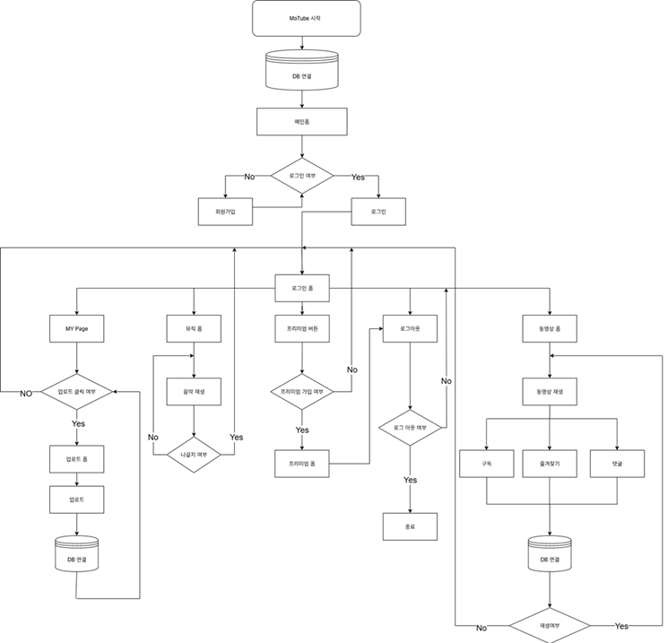
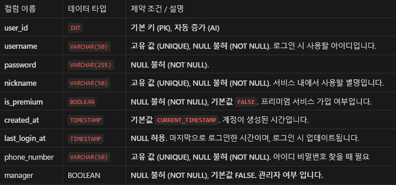
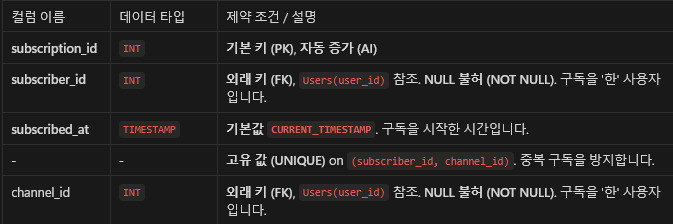
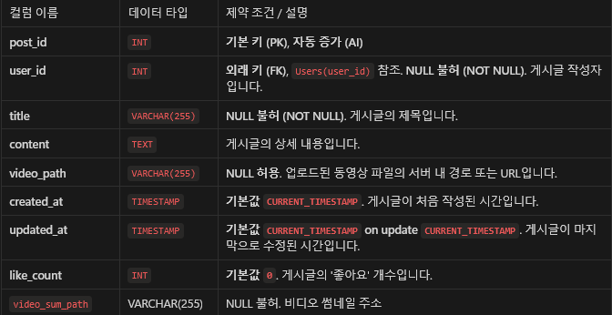
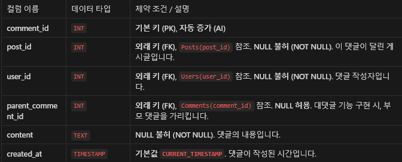
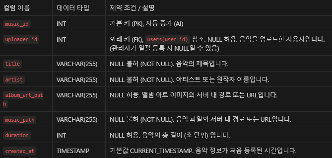
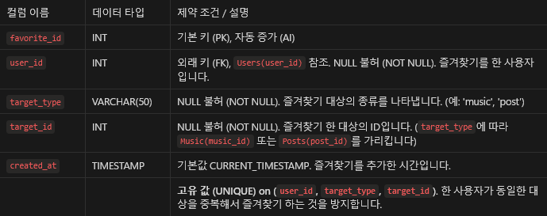
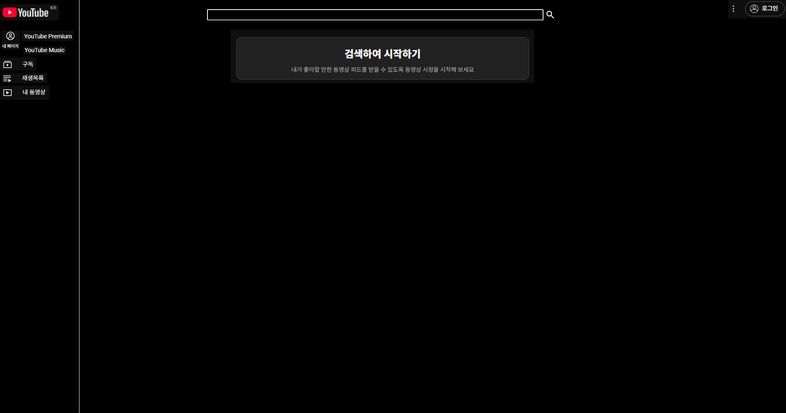

# 🎬 웹 미디어 플레이어 팀 프로젝트 (Web Media Player)

   

> **C# WinForms를 기반으로 한 데스크톱 미디어 스트리밍 플랫폼입니다.** > 사용자들은 동영상을 시청하고, 음악을 감상하며, 직접 콘텐츠를 업로드하여 다른 사람들과 공유할 수 있습니다.

<br>

## 📅 프로젝트 정보

- **프로젝트 기간**: 2025.07 ~ 2025.08
- **개발 유형**: 팀 프로젝트

### 🧑‍🤝‍🧑 팀원 및 역할
| 이름 | 역할 | 담당 업무 |
| :--- | :--- | :--- |
| **강승진** | 데이터베이스 | DB 설계 및 구축, 쿼리 최적화 |
| *(팀원 이름)* | *(역할)* | *(내용)* |

<br>

## ✨ 주요 기능 (Key Features)

- **🔐 사용자 인증**
  - 회원가입, 로그인, 아이디/비밀번호 찾기 등 완벽한 인증 시스템 구현.
- **📺 미디어 스트리밍**
  - 동영상 및 음악 파일의 실시간 스트리밍 재생 지원.
- **📂 콘텐츠 관리**
  - 사용자가 직접 자신의 미디어(영상, 음악)를 업로드하고 관리 가능.
- **💬 소셜 네트워크**
  - 게시글 댓글/대댓글 작성, 사용자 간 채널 구독 및 커뮤니티 기능.
- **👤 마이페이지**
  - 개인 정보 수정, 구독 등급 관리 및 활동 내역 확인.
- **🛡️ 관리자 모드**
  - 관리자 전용 페이지를 통한 전체 사용자 및 콘텐츠 통합 관리.

<br>

## 🛠️ 기술 스택 (Tech Stack)

| 구분 | 상세 내용 |
| :--- | :--- |
| **Language** | C# |
| **Framework** | .NET Framework |
| **UI Platform** | Windows Forms (WinForms) |
| **DBMS** | MySQL |

<br>

## 📂 프로젝트 구조 (Project Structure)

```bash
📁 TpMain/
│
├── 📄 Program.cs             # 프로그램 진입점
├── 📄 TpMain.csproj          # 프로젝트 설정 파일
│
├── 📁 Models/                # 데이터 모델
│   ├── 📄 UserSession.cs     # 사용자 세션 관리
│   └── 📄 VideoInfo.cs       # 비디오 정보 객체
│
├── 📁 Services/              # 비즈니스 로직 및 DB
│   └── 📄 Class1.cs          # DB 연결 및 공통 유틸리티 함수
│
├── 📁 Views/                 # UI (Forms)
│   ├── 📁 00_Main/           # 메인 화면 및 플레이어
│   │   ├── 📄 MainForm1.cs
│   │   ├── 📄 VideoView.cs   # 비디오 플레이어
│   │   └── 📄 MusicPlay.cs   # 뮤직 플레이어
│   │
│   ├── 📁 01_User/           # 회원 관리
│   │   ├── 📄 Login.cs
│   │   ├── 📄 NewMember.cs   # 회원가입
│   │   ├── 📄 IDfnd.cs       # 아이디 찾기
│   │   ├── 📄 PWfind.cs      # 비밀번호 찾기
│   │   └── 📄 MyPage.cs      # 마이페이지
│   │
│   ├── 📁 02_Content/        # 콘텐츠 업로드
│   │   ├── 📄 Upload.cs
│   │   └── 📄 UpSub.cs
│   │
│   └── 📁 03_Admin/          # 관리자 기능
│       └── 📄 ManagerForm.cs
│
└── 📁 Resources/             # 리소스 (이미지, 아이콘 등)
```
# 🛠️ 기술 스택 (Tech Stack)

| 구분 | 상세 내용 |
| :--- | :--- |
| **Language** | C# |
| **Framework** | .NET Framework |
| **UI Platform** | Windows Forms (WinForms) |
| **DBMS** | MySQL |

<br>

# 🔄 순서도 (Flowchart)



<br>

# 🗄️ 데이터베이스 구조 (Database Schema)

## 🗺️ EER 다이어그램


<br>

## 📝 테이블 상세 (Table Details)

| **🧑‍💻 Users (사용자)** | **📺 Subscriptions (구독)** |
| :---: | :---: |
|  |  |
| **📝 Posts (게시글)** | **💬 Comments (댓글)** |
|  |  |
| **🎶 Music (음악)** | **⭐ Favorites (즐겨찾기)** |
|  |  |

# 시연 영상
[](https://youtu.be/nmizB-60_aw)
